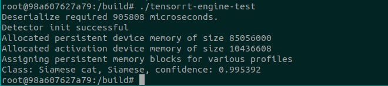
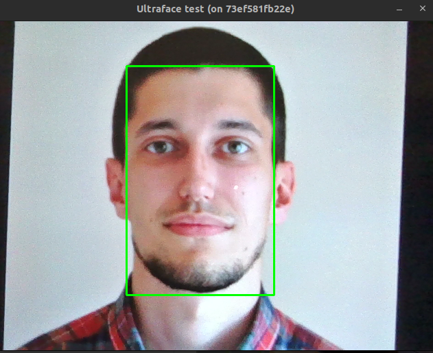

## TensorRT-onnx-dockerized-inference
* <b>TensorRT</b> engine inference with <b>ONNX model conversion</b>
* <b>Dockerized</b> environment with: CUDA 10.2, TensorRT 7, OpenCV 3.4 built with CUDA
* <b>ResNet50</b> preprocessing and postprocessing implementation

### Quick docker setup:
* Requirements are: [docker](https://docs.docker.com/get-docker/) and [nvidia-docker](https://docs.nvidia.com/datacenter/cloud-native/container-toolkit/install-guide.html)
* Download TensorRT 7 installation from [link](https://developer.nvidia.com/compute/machine-learning/tensorrt/secure/7.2.1/local_repos/nv-tensorrt-repo-ubuntu1804-cuda10.2-trt7.2.1.6-ga-20201006_1-1_amd64.deb)
* Place downloaded TensorRT 7 deb file into root dir of this repo
* Pull OR build: container can be: pulled from the packages OR built localy from sources
``` bash

# Pull docker image
docker pull ghcr.io/mrlaki5/tensorrt-onnx-dockerized-inference:latest

# Build from sources
cd ./docker
./build.sh
```
* Run
``` bash
cd ./docker
./run.sh
```

### ResNet50 inference test

``` bash
./ResNet50_test
```
* [Input image](https://pixabay.com/photos/cat-siamese-cat-fur-kitten-2068462)
* Output: Siamese cat, Siamese (confidence: 0.995392)


### Ultraface face detector inference
* Note: for this test, camera device is required. Test will start GUI showing camera stream overlaped with face detections.
``` bash
./Ultraface_test
```

